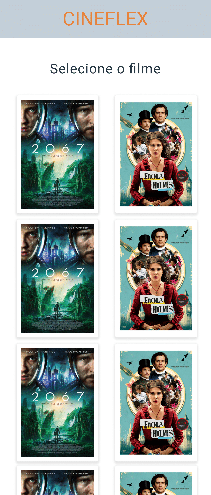
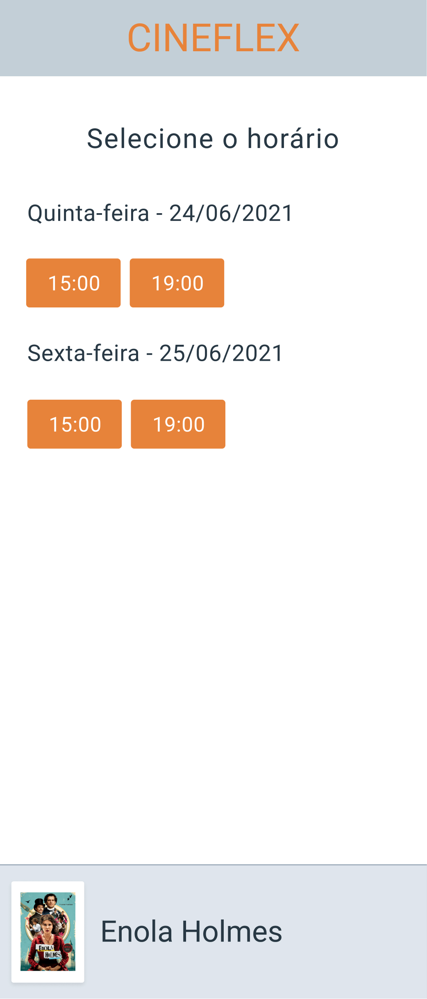
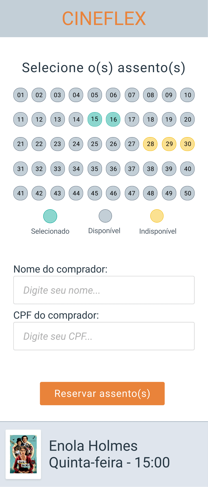
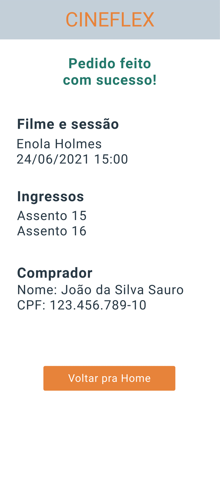

# <p align = "center"> Cineflex </p>

<div align = "center" >
    
    
    
    
</div>


##  :clipboard: Descrição

Neste projeto construí uma aplicação para reservar assentos em sessões no cinema!

***

## :computer:	 Tecnologias e Conceitos

- React
- REST APIs
- Axios
- react-router-dom

***

## 🏁 Rodando a aplicação

Este projeto foi inicializado com o [Create React App](https://github.com/facebook/create-react-app), então certifique-se que voce tem a ultima versão estável do [Node.js](https://nodejs.org/en/download/) e [npm](https://www.npmjs.com/) rodando localmente.

Primeiro, faça o clone desse repositório na sua maquina:

```
git clone git@github.com:gabrzeoN/cineflex.git
ou
git clone https://github.com/gabrzeoN/cineflex.git
```

Depois, dentro da pasta, rode o seguinte comando para instalar as dependencias.

```
npm install
```

Finalizado o processo, é só inicializar o servidor
```
npm start
```
